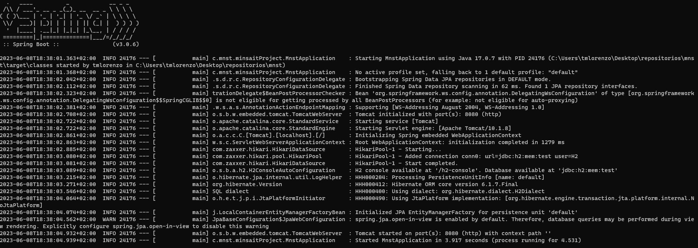
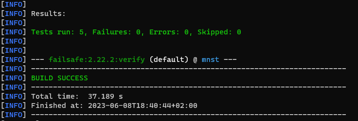
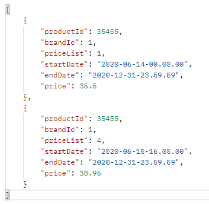
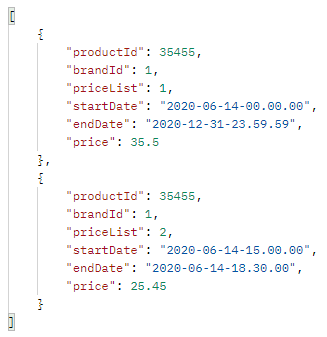
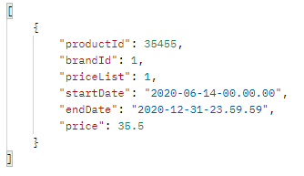
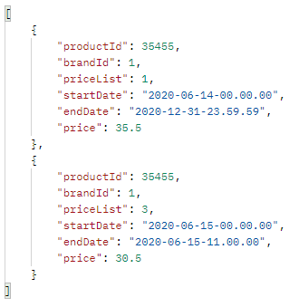

# PRICE (PRICE SEARCH APP)

## Description

Price search APP is a service to find and check prices according with specific parameters. With this service is possible to search prices based in an specific application date, product ID and brand ID.

Exposes an endpoint (v1/price) to obtain the prices stored in H2 database.

## Definition of functionality - Application behavior

Search prices according to an application date. The service will search for those prices that are available on that date according to the start date and end date of each one. If two or more prices have the same rate, it will take the one or those with the highest priority. If, for example, two prices have the same rate and also have the same priority, it will return both.

## Prerequisites

### Compile the project

```
 mvn clean compile
```

### Start the service

NOTE: When starting the application, the database is automatically loaded with the data provided

Using the console, you can start the microservice and then access it through a browser using localhost:8080 (http://localhost:8080)

To start the service using console:

```shell
  mvn spring-boot:run
```



### Test execution

The 5 end-to-end tests that were specified have been developed. In order to verify its correct execution it is necessary:

1 - Start the application using console (as explained in the previous point): 'mvn spring-boot:run'
2 - In other console window, in the project path execute:

```shell
  mvn clean verify
```



## Access and use the service

To access and use the microservice through a browser it is necessary to point to the address "localhost:8080/v1/price"
"v1/price" is the endpoint available to check the data price.

### Request

The service must be invoked with the following example call (specifying 'applicationDate', 'productId' and 'brandId')

```shell
http://localhost:8080/v1/price?applicationDate=2020-06-16-21.00.00&productId=35455&brandId=1
```
The response will be:




## REST Test Result

#### CASE 1: Request at 10:00 on the 14th of product 35455 for brand 1

##### Request

```shell
http://localhost:8080/v1/price?applicationDate=2020-06-14-10.00.00&productId=35455&brandId=1
```
##### Response


#### CASE 2: Request at 16:00 on the 14th of product 35455 for brand 1

##### Request

```shell
http://localhost:8080/v1/price?applicationDate=2020-06-14-16.00.00&productId=35455&brandId=1
```
##### Response



#### CASE 3: Request at 21:00 on the 14th of product 35455 for brand 1

##### Request

```shell
http://localhost:8080/v1/price?applicationDate=2020-06-14-16.00.00&productId=35455&brandId=1
```
##### Response



#### CASE 4: Request at 10:00 on the 15th of product 35455 for brand 1

##### Request

```shell
http://localhost:8080/v1/price?applicationDate=2020-06-14-16.00.00&productId=35455&brandId=1
```
#### Response



#### CASE 5: Request at 21:00 on the 16th of product 35455 for brand 1

##### Request

```shell
http://localhost:8080/v1/price?applicationDate=2020-06-14-16.00.00&productId=35455&brandId=1
```
##### Response


